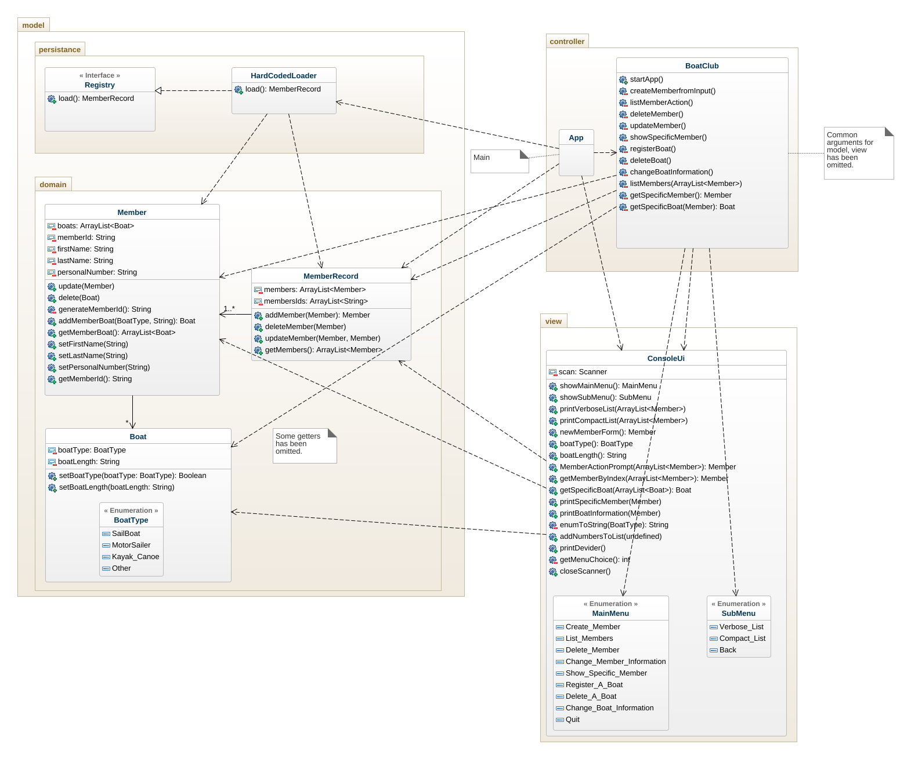
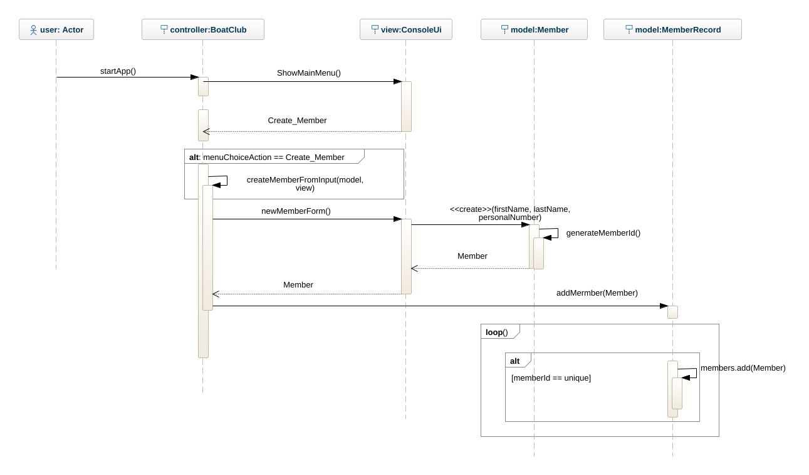

# Usage:
`./gradlew build`
`./gradlew run -q --console=plain`

# Goals
Understand basic Object Oriented Design and Implementation Principles (GRASP)  
Can work within an architectural pattern (MVC) and know how to assign responsibilities within this architecture.  
Can deliver a working piece of software with high quality and use version management.  
Understands how implementation and diagrams conform to eachother and the differences between the diagrams (class, sequence and object).  

# Boatclub OO-Design
This document describes the design according to the requirements presented in assignment 2.

## Architectural Overview
The application uses the model-view-controller (MVC) architectural pattern. The view is passive and gets called from the controller. The view may only read information from the model, not directly change it.

## Detailed Design
### Class Diagram

### Sequence Diagram
Representing a user registering from the view using the menu.
(There are also some persistant users.)

